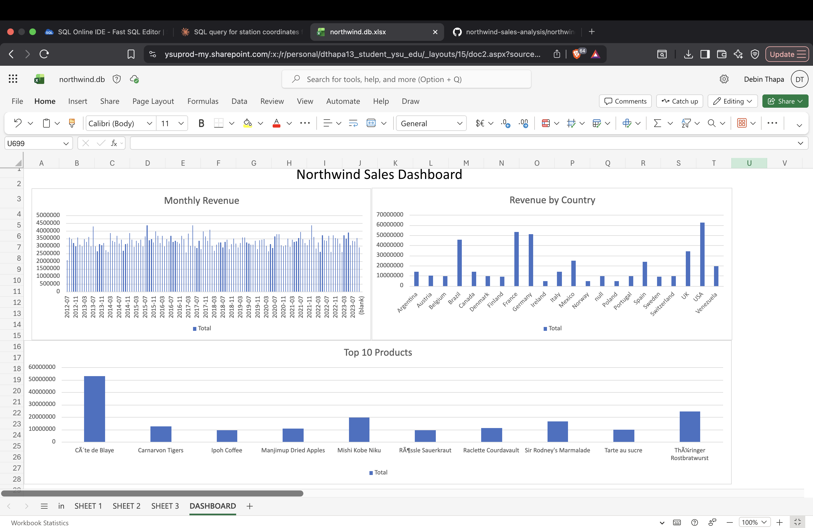

# Northwind Sales Analysis

## Project Overview
This project analyzes sales data from the fictional Northwind 
company using SQL. It includes 7 queries that uncover business 
insights about revenue, products, employees, and customers.

## Dashboard Preview

## Business Questions Answered
1. Which products generate the most revenue?
2. Which countries have the highest sales?
3. Who are the top performing employees?
4. Which product categories sell the most?
5. What is the monthly revenue trend?
6. How do products rank within each category?
7. What is the running total of revenue over time?

## Tools Used
- SQL (SQLite)
- VS Code
- GitHub

## Author
Debin Thapa
Computer Science Student — Youngstown State University
